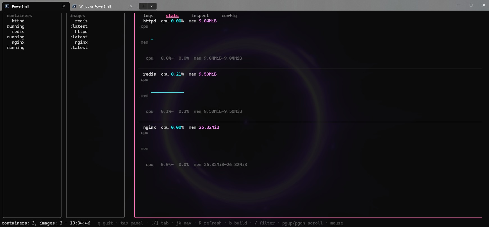
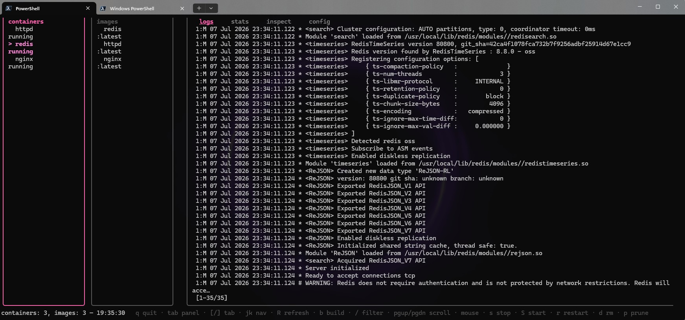
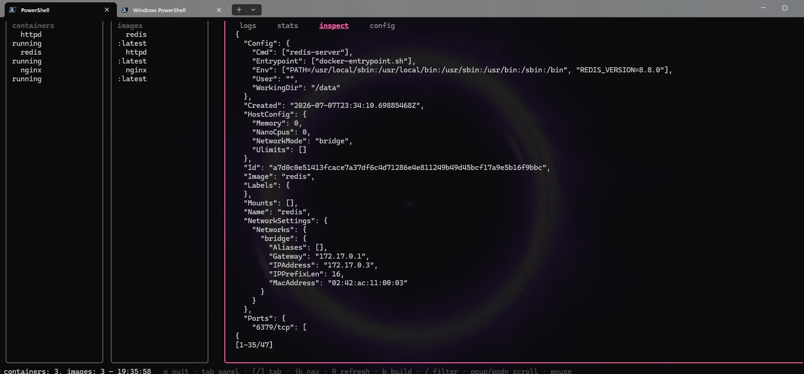

# lazywslcontainer

A simple terminal UI for WSL containers (`wslc.exe`), inspired by
[lazydocker](https://github.com/jesseduffield/lazydocker).

[](https://go.dev)
[](LICENSE)
[](https://learn.microsoft.com/en-us/windows/wsl/tutorials/wsl-containers)

> Not affiliated with Microsoft or the lazydocker project.

## Why

`wslc.exe` ships built into WSL and gives you a familiar Docker-like CLI for
building, running, and inspecting Linux containers on Windows. Memorising the
commands and jumping between terminal windows is a pain — `lazywslcontainer`
puts the container list, logs, stats, images, and common actions one keypress
away in a single TUI.

## Features

- **Containers panel** — list, stop, start, restart, remove, prune, view logs
- **Images panel** — list, inspect, remove, prune, run (inline args prompt), build
- **Stats tab** — multi-row ASCII sparklines for CPU% and memory per container,
  with 60-sample history (2s polling), cyan/magenta color coding, min/max/cur labels
- **Inspect tab** — pretty-printed JSON (flattened, sorted, indented)
- **Logs tab** — tail with scroll (`pgup`/`pgdown`/`g`/`G`)
- **Filter** — `/` to filter containers and images by name (case-insensitive)
- **Mouse** — click to select containers/images and switch tabs, scroll wheel to scroll
- **Confirm prompts** — destructive actions ask `y/n` before executing
- **Inline prompts** — run and build with editable argument strings

## Requirements

- Windows 10/11 with WSL and `wslc.exe` available (`wsl --update` to the latest
  version — needs wslc 2.9.3.0 or later)
- Go >= 1.24 to build from source

## Install / build

```powershell
git clone https://github.com/gregorypilar/lazywslcontainer.git
cd lazywslcontainer
go build -o lazywslcontainer.exe .
```

Then run:

```powershell
./lazywslcontainer.exe
```

## Screenshots





## Keybindings

See [docs/keybindings.md](docs/keybindings.md) for the full list.

Quick reference:

| Key          | Action                                   |
| ------------ | ---------------------------------------- |
| `tab`        | Next panel                               |
| `[` / `]`    | Previous / next tab (logs/stats/inspect) |
| `j` / `k`    | Move selection down / up                 |
| `enter`      | Run selected image (images panel)        |
| `b`          | Build an image                           |
| `s` / `S`    | Stop / start container                   |
| `r`          | Restart container                        |
| `d`          | Remove (with confirm)                    |
| `p`          | Prune (with confirm)                     |
| `/`          | Filter side list                         |
| `pgup`/`pgdn`| Scroll main panel                        |
| `g` / `G`    | Scroll to top / bottom                   |
| `R`          | Force refresh                            |
| `q`          | Quit                                     |

## Config

See [docs/Config.md](docs/Config.md). Config loading is planned; defaults are
used today.

## Status

Early / experimental. Built against `wslc 2.9.3.0`. See [TODO.md](TODO.md)
for what's done and what's planned.

## License

[MIT](LICENSE) © Gregor Pilar